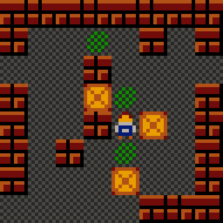

# Soko64 📦
[](https://bullseye2d.org) [](https://dart.dev/get-dart) 

# Play on itch.io
You can play Soko64 directly in your browser:
[🕹️ Play Soko64](https://joemanaco.itch.io/soko64)

## About Soko64

**Soko64** is a ultra lo-res (64x64 pixels) Sokoban-style puzzle game crafted in just 24 hours using the [**Bullseye2D**](https://bullseye2d.org) game engine for Dart. 



## Instructions / Controls
Navigate Manny and solve puzzles with these simple controls:

*   **Arrow Keys:** Move Manny
*   **U:** Undo last move
*   **R:** Restart current level
*   **ESC:** Return to Title Screen

## Getting Started

If you'd like to explore the code, run the game locally, or contribute, follow these steps:

### Prerequisites

*   [Git](https://git-scm.com/book/en/v2/Getting-Started-Installing-Git)
*   [Dart SDK](https://dart.dev/get-dart)

### Installation & Running

1.  **Activate webdev**
    ```bash
    dart pub global activate webdev
    ```

2.  **Clone the repository:**
    ```bash
    git clone https://github.com/JochenHeizmann/soko64.git
    cd soko64
    ```

3.  **Run the development server:**
    ```bash
    webdev serve
    ```
    This will typically start a development server and make the game accessible at `http://localhost:8080/` (or another port if 8080 is in use).

## Credits
*   **Code, Art & Level Design:** [Jochen Heizmann](https://github.com/JochenHeizmann)
*   **NES 8-Bit Sound Effects:** [Shiru / shiru8bit](https://opengameart.org/content/nes-8-bit-sound-effects)
*   **Music:** [Zane Little Music](https://opengameart.org/content/a-bag-of-chips)

